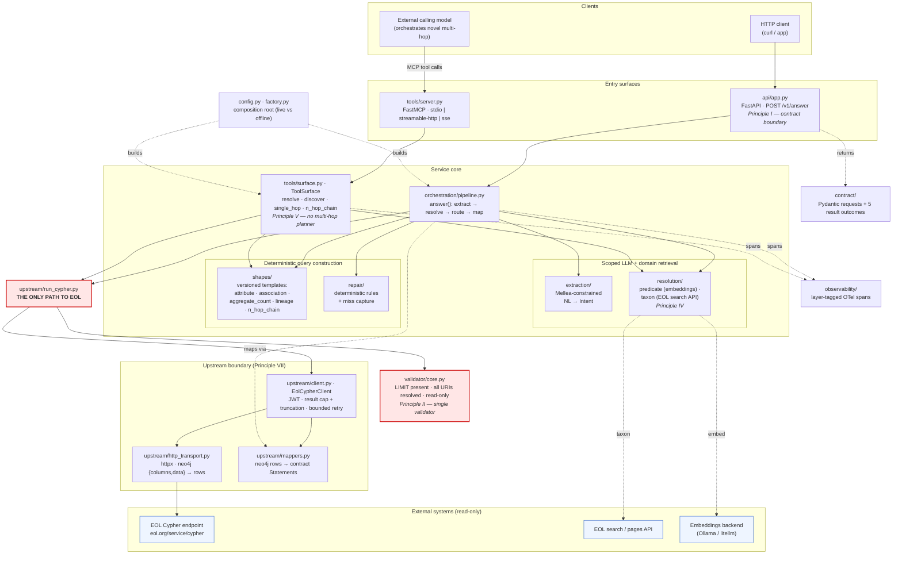

# System Architecture

The EOL Trait Query Service answers natural-language biodiversity questions against the
Encyclopedia of Life (EOL) trait graph and returns **structured, sourced** results. Clients
never write or see Cypher.

It is a **two-tier** design with a **single hard validator** between everything and EOL:

- a **service-side, tightly-scoped LLM** path (the FastAPI `/v1/answer` contract) handles the
  known canonical shapes (US-1–US-5) deterministically: NL→intent extraction, term/taxon
  resolution by retrieval, a catalog of versioned query shapes, and deterministic repair;
- an **external calling model** orchestrates the rare novel multi-hop long tail (US-7) by
  composing read-only single-hop tools exposed over **MCP**.

Both paths reach EOL **only** through `run_cypher`, which runs the one validator first
(Constitution Principle II — One Validator, No Bypass).

## Layer responsibilities

| Layer | Module | Responsibility |
|-------|--------|----------------|
| Contract boundary | `api/app.py`, `contract/` | NL question in → one of five structured outcomes out. Cypher/neo4j never cross it (Principle I). |
| MCP tool surface | `tools/server.py`, `tools/surface.py` | Read-only tools for the external calling model. No write tool, no multi-hop planner (Principle V). |
| Orchestration | `orchestration/pipeline.py` | `extract → resolve → route → build → run_cypher → map`. Confidence-gated; low confidence → `needs_clarification`. |
| Scoped LLM | `extraction/` | Mellea constrained decoding: NL → format-valid `Intent`. |
| Domain retrieval | `resolution/` | Term→URI and name→page_id grounding by retrieval over the embedded catalog + EOL search API (Principle IV). |
| Query shapes | `shapes/` | Versioned, testable templates for the known shapes + anticipated n-hop chains (Principle III). |
| Validator | `validator/core.py` | Single entry point: LIMIT present, every URI resolved, read-only (Principle II). |
| Upstream | `upstream/` | The only network boundary to EOL: JWT, caps + truncation flag, bounded retry, error mapping (Principle VII). |
| Cross-cutting | `observability/`, `config.py`, `factory.py` | Layer-tagged tracing; composition root chooses live vs offline deps. |

## The five outcomes

Every `/v1/answer` request resolves to exactly one: `answer`, `no_records`,
`needs_clarification`, `upstream_unavailable`, `out_of_capability`.
