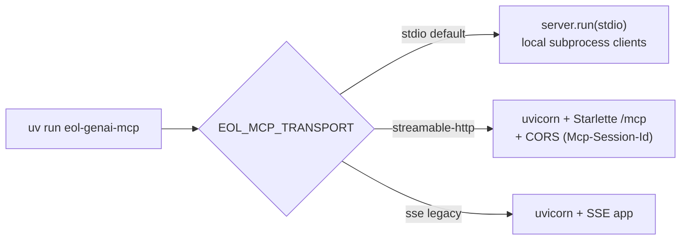

# MCP Call Sequence

How a tool call from the **external calling model** flows through each major layer when it
orchestrates a novel multi-hop question (US-7). The calling model composes read-only tools — the
service deliberately exposes **no "plan-a-multi-hop-chain" tool** (Principle V); planning stays on
the client. Every tool that touches EOL goes through `run_cypher` → the single validator
(Principle II).

The MCP surface (`tools/server.py` over `tools/surface.py`) exposes:
`resolve_predicate`, `resolve_taxon`, `list_predicates`, `get_schema`, `run_cypher`,
`single_hop`, `n_hop_chain`.

## End-to-end: resolve, then chain hops

A representative orchestration — "what do the prey of sea otters eat?" — resolving the taxon and
predicate, then walking two association hops.

```mermaid
sequenceDiagram
    autonumber
    actor CM as Calling Model
    participant MCP as FastMCP server<br/>(tools/server.py)
    participant TS as ToolSurface<br/>(tools/surface.py)
    participant RES as Resolution<br/>(resolution/)
    participant SHP as Shapes<br/>(shapes/)
    participant RC as run_cypher<br/>(upstream/run_cypher.py)
    participant VAL as Validator<br/>(validator/core.py)
    participant CL as EolCypherClient<br/>(upstream/client.py)
    participant TR as HttpEolTransport<br/>(http_transport.py)
    participant EOL as EOL endpoints

    Note over CM,EOL: Phase 1 — Ground the terms (no Cypher; never invent a URI)

    CM->>MCP: resolve_taxon("sea otter")
    MCP->>TS: surface.resolve_taxon(name)
    TS->>RES: taxon_resolver.resolve(name)
    RES->>EOL: GET /api/search (ranked {id,title})
    EOL-->>RES: candidates
    RES-->>TS: [TaxonCandidate{page_id,score}]
    TS-->>MCP: list[dict]
    MCP-->>CM: candidates (model picks a page_id)

    CM->>MCP: resolve_predicate("eats")
    MCP->>TS: surface.resolve_predicate(text)
    TS->>RES: predicate_resolver.resolve(text)
    RES->>EOL: embed query (Ollama/litellm)
    EOL-->>RES: vector
    Note over RES: cosine search over the<br/>persisted embedded catalog
    RES-->>TS: [PredicateCandidate{uri,type,score}]
    TS-->>MCP: list[dict]
    MCP-->>CM: ranked URIs (model picks uri + direction)

    Note over CM,EOL: Phase 2 — Walk the chain (set-valued; one LIMIT per call)

    CM->>MCP: single_hop([page_ids], predicate_uri, direction)
    MCP->>TS: surface.single_hop(set, uri, direction)
    TS->>SHP: build_set_hop_query(ids, uri, cap, direction)
    SHP-->>TS: Cypher (with LIMIT)
    TS->>RC: run_cypher(query, {uri}, client)
    RC->>VAL: validate(query, resolved_uris)
    VAL-->>RC: Verdict(ok)
    alt verdict not ok
        RC-->>TS: raise ValidatorRejection (no upstream call)
    else verdict ok
        RC->>CL: client.fetch(query)
        loop bounded retry + backoff
            CL->>TR: transport(query, format)
            TR->>EOL: GET /service/cypher (JWT header)
            EOL-->>TR: {columns, data}
            TR-->>CL: row dicts
        end
        CL-->>RC: UpstreamResult(rows capped, truncated)
    end
    RC-->>TS: UpstreamResult
    TS-->>MCP: {page_ids, truncated}
    MCP-->>CM: partner page_ids

    Note over CM: Model feeds these page_ids into the next single_hop,<br/>or calls n_hop_chain to run the whole chain under ONE LIMIT.
```

## Layer-by-layer contract

| # | Layer | What it guarantees |
|---|-------|--------------------|
| 1 | **FastMCP server** (`tools/server.py`) | Thin adapter: binds each `ToolSurface` method as an MCP tool over the selected transport (`stdio` default, or `streamable-http`/`sse`). Serializes models to dicts. No business logic. |
| 2 | **ToolSurface** (`tools/surface.py`) | The read-only tool set the model composes. Set-in/set-out hops so chaining never fans out. `FORBIDDEN_METHODS` asserts no multi-hop planner ever grows here (Principle V). |
| 3 | **Resolution** (`resolution/`) | Grounds phrases → catalog URIs and names → page_ids by retrieval. Returns `[]` rather than inventing a URI. Upstream failures map to `UpstreamUnavailable`. |
| 4 | **Shapes** (`shapes/`) | Build deterministic, versioned Cypher with a mandatory `LIMIT`; `n_hop_chain` runs the whole chain under a **single** LIMIT to guard silent per-hop truncation. |
| 5 | **run_cypher** (`upstream/run_cypher.py`) | The only path to EOL. Calls the validator **first**; executes only on a positive verdict. |
| 6 | **Validator** (`validator/core.py`) | LIMIT present · every URI literal is in the resolved set (case-sensitive) · read-only. A violation raises `ValidatorRejection` and the network is never touched. |
| 7 | **EolCypherClient** (`upstream/client.py`) | Attaches result cap + truncation flag; bounded retry with backoff; maps transport failure → `UpstreamUnavailable` (distinct from valid empty rows). |
| 8 | **HttpEolTransport** (`http_transport.py`) | The sole network boundary: `GET` with `JWT` header; parses neo4j `{columns, data}` into row dicts. The neo4j envelope never escapes this module (Principle I). |

## Transport selection

`tools/server.py:main()` reads `EOL_MCP_TRANSPORT`:



`build_live_surface()` is the composition root for the MCP path — it needs `EOL_JWT` and the
cached predicate index; tests inject an offline surface into `create_server()` instead.
